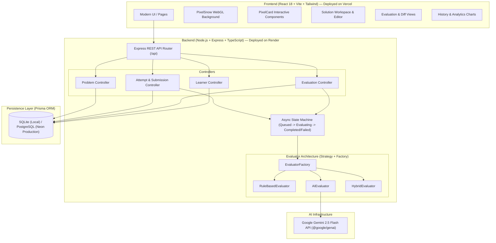

# 🚀 LLD_Platform — Low-Level System Design Practice & AI Evaluation Platform

[](https://lld-platform-lake.vercel.app/)
[](https://lld-platform-1.onrender.com/)
[](https://www.typescriptlang.org/)
[](https://react.dev/)
[](https://vitejs.dev/)
[](https://nodejs.org/)
[](https://expressjs.com/)
[](https://www.prisma.io/)
[](https://ai.google.dev/)
[](https://tailwindcss.com/)
[](https://vitest.dev/)
[](https://opensource.org/licenses/MIT)

An intelligent, interactive **Low-Level System Design (LLD)** platform engineered to help software developers master Object-Oriented Design (OOD), SOLID principles, design patterns, and distributed concurrency.

Powered by **Google Gemini 2.5 Flash** and deterministic rule rubrics, the platform automatically evaluates candidate architecture proposals across **8 strict architectural criteria**, citing direct evidence quotes, surfacing architectural risks, and generating actionable improvement recommendations.

---

> ### 🌐 Live Production Deployments
>
> | Service | Status | URL |
> |---|---|---|
> | 🖥️ **Frontend Web App** |  | **[https://lld-platform-lake.vercel.app/](https://lld-platform-lake.vercel.app/)** |
> | ⚙️ **Backend API** |  | **[https://lld-platform-1.onrender.com/](https://lld-platform-1.onrender.com/)** |
> | 🩺 **API Health Check** |  | **[https://lld-platform-1.onrender.com/health](https://lld-platform-1.onrender.com/health)** |
> | 📚 **Problems API** |  | **[https://lld-platform-1.onrender.com/api/problems](https://lld-platform-1.onrender.com/api/problems)** |

---

## 📑 Table of Contents

- [Live Deployments](#-live-production-deployments)
- [Technical Documentation & AI Report](#-technical-documentation--publications)
- [Overview](#-overview)
- [Key Features](#-key-features)
- [8-Criterion Architectural Rubric](#-8-criterion-architectural-rubric)
- [System Architecture & Design Patterns](#-system-architecture--design-patterns)
- [Key Architectural & Engineering Decisions](#-key-architectural--engineering-decisions)
- [Current System Limitations & Future Scope](#-current-system-limitations--future-scope)
- [🤖 AI Usage Report](#-ai-usage-report)
- [Data Model & Entity Relationships](#-data-model--entity-relationships)
- [Tech Stack](#-tech-stack)
- [Problem Catalog](#-problem-catalog)
- [Project Directory Structure](#-project-directory-structure)
- [API Reference](#-api-reference)
- [Cloud Deployment Guide](#-cloud-deployment-guide)
- [How to Run the Project (Local Development)](#-how-to-run-the-project-local-development)
- [Testing & Quality Assurance](#-testing--quality-assurance)
- [Author & Contact](#-author--contact)

---

## 📄 Technical Documentation & Publications

The project includes formal, publication-grade documentation for academic, pedagogical, and system design review:

| Document | Format | Description |
|---|---|---|
| **AI Usage Report** | [Markdown](AI_USAGE.md) | Transparent, formal disclosure of AI models used (Gemini 2.5 Flash, Antigravity, Claude), prompt engineering calibration, AST verification, and ethical development lifecycle. |
| **Research Note** | [PDF](Research_Note.pdf) • [HTML](Research_Note.html) | Formal 4-page academic whitepaper detailing the automated architectural evaluation engine, the 8-criterion rubric, AST lexical scanning, Gemini 2.5 Flash schema enforcement, empirical benchmarks, and regression analysis. |
| **Design Note** | [PDF](Design_Note.pdf) • [HTML](Design_Note.html) | Comprehensive 4-page software architecture design document detailing MVP scope, 8-stage end-to-end user flows, Prisma entity models, backend service hierarchies, and 6 core engineering trade-offs. |

---

## 🌟 Overview

While algorithmic platforms like LeetCode focus predominantly on data structures and time complexity, Low-Level Design (LLD) interviews demand a radically different skill set:
- **Modular decomposition** and Single Responsibility Principle (SRP).
- **Loose coupling** and interface-driven abstractions.
- **Appropriate design pattern selection** (Strategy, State, Observer, Factory).
- **Robust concurrency models**, thread safety, and race-condition prevention.
- **Extensibility** without modifying core domain engines (Open/Closed Principle).

**LLD_Platform** bridges this gap by offering:
1. **Interactive Workspace**: A rich markdown and code editor with customizable templates and instant validation.
2. **Multi-Engine Evaluation**: Pluggable evaluation backends (AI-driven with Gemini 2.5 Flash, deterministic rule-based, or hybrid).
3. **Evidence-Based Grading**: Structured 1–5 scoring per criterion, backed by textual excerpts, concerns, and suggestions.
4. **Retry & Delta Diffs**: Visual before-and-after comparisons showing score progressions ($\Delta S_i = S_{i, t} - S_{i, t-1}$) across problem attempts.
5. **Session History & Rubric Analytics**: Longitudinal trend tracking to identify recurring architectural blind spots.

---

## ✨ Key Features

### 1. 🎯 Curated Real-World LLD Problems
- Diverse problem scenarios with explicit functional requirements, expected deliverables, and strict scale constraints (e.g., handling 10,000+ vehicles/day or 50-story skyscraper elevator dispatching).
- Difficulty badges, pattern tags, and difficulty-reactive visual themes.

### 2. 🤖 Pluggable Evaluation Engines
- **AI Evaluator (`AIEvaluator`)**: Harnesses `@google/genai` (Gemini 2.5 Flash) with strict JSON schema enforcement to grade code and design narratives against rigorous anchor rubrics.
- **Rule-Based Evaluator (`RuleBasedEvaluator`)**: Performs rapid, deterministic keyword, token, and structural AST checks (validating classes, methods, concurrency tokens, and pattern presence).
- **Hybrid Evaluator (`HybridEvaluator`)**: Merges deterministic safety and sanity checks with nuanced LLM architectural reasoning.
- **Offline Heuristic Engine**: Built-in fallback system that gracefully continues evaluation if the external AI API is unreachable or unconfigured.

### 3. 🔍 Granular 8-Criterion Rubric
- Evaluates every submission across eight standardized dimensions:
  - Requirement Understanding
  - Responsibility Assignment (SRP)
  - Coupling & Cohesion
  - Encapsulation
  - Abstraction & Design Patterns
  - Extensibility (Open/Closed Principle)
  - Edge Case & Concurrency Handling
  - Explanation & Trade-off Quality
- Each criterion includes a score (1–5), citation evidence, concerns, actionable suggestions, and confidence scores (0.0–1.0).

### 4. 🔄 Retry & Diff View
- Compare the latest attempt against past submissions.
- Visual score delta indicator (`+1.0`, `-0.5`) per criterion to quickly inspect whether changes improved decoupling, encapsulation, or concurrency.
- Side-by-side or unified textual diff viewer with character-level highlights.

### 5. 📊 Learner Analytics & History
- Comprehensive timeline of all practice sessions.
- Average rubric score indicators and criterion breakdown badges.
- Attempt trend charts showing improvement trajectories over time.

### 6. 🌌 Retro-Modern UI Aesthetic
- Dark mode interface styled with deep obsidian tones (`#0d0d14`), subtle borders, and glassmorphic navigation.
- **WebGL Particle Snow (`PixelSnow`)** dynamic background canvas for an immersive engineering vibe.
- **Interactive Shader Grid (`PixelCard`)** problem cards that react dynamically to cursor hover.
- Full mobile and desktop responsiveness.

---

## 📐 8-Criterion Architectural Rubric

Every submission is evaluated against this standardized grading framework:

| # | Criterion | Focus Area | Score 1 Anchor (Deficient) | Score 5 Anchor (Exemplary) |
|---|---|---|---|---|
| **1** | **Requirement Understanding** | Scope, functional & non-functional bounds | Misses core requirements, invents irrelevant features, or fundamentally misunderstands the problem goals. | Comprehensive coverage of functional and non-functional requirements, explicit bounds, and clear constraints. |
| **2** | **Responsibility Assignment (SRP)** | Single Responsibility Principle & entity roles | God objects handling DB, UI, state, and business logic simultaneously. | Clean SRP enforcement with single focused responsibility per entity, well-bounded context. |
| **3** | **Coupling & Cohesion** | Module interdependence & internal focus | Tightly coupled monolithic design; changing one class requires cascading updates across all classes. | Loose coupling via interfaces and dependency injection; high cohesion within domain models. |
| **4** | **Encapsulation** | Information hiding & invariant safety | Exposes mutable public fields everywhere; external code mutates state directly. | Strict encapsulation; state mutated only via rich domain methods with invariant validation. |
| **5** | **Abstraction & Design Patterns** | Strategic pattern application | No abstractions; excessive nested if-else/switch blocks replacing polymorphism. | Judicious design pattern selection (Strategy, State, Factory, Observer) cleanly separating concerns. |
| **6** | **Extensibility (Open/Closed)** | Ease of adding new requirements | Rigid structure; adding a new feature requires modifying existing core execution paths. | Highly extensible; new behaviors added seamlessly via interface implementations without touching engine core. |
| **7** | **Edge Case & Concurrency** | Race conditions, locks, thread safety | Ignores errors, concurrency, race conditions, and invalid inputs completely. | Robust error handling, explicit thread-safety / concurrency locks, transaction boundaries, and graceful degradation. |
| **8** | **Explanation Quality** | Rationale, design decisions, trade-offs | Sparse or incomprehensible text; no rationale provided for key architectural choices. | Crystal-clear structure, detailed design rationales, explicit trade-off analysis, and class relationship flow. |

---

## 🏛️ System Architecture & Design Patterns

### Architecture Diagram



### Design Patterns Utilized

1. **Strategy Pattern**: Evaluator engines implement a common `Evaluator` interface (`evaluate(submission, problemContext)`). The system can dynamically swap between `AIEvaluator`, `RuleBasedEvaluator`, and `HybridEvaluator` without affecting callers.
2. **Factory Pattern**: `EvaluatorFactory.getEvaluator(type)` encapsulates the instantiation logic, credential checks, and fallback mechanisms for evaluation engines.
3. **State Pattern**: Evaluator progress transitions deterministically through states (`Queued` → `Evaluating` → `Completed` | `Failed`).
4. **Idempotency Pattern**: Submissions accept an `idempotencyKey` to guarantee that network retries or repeated button presses do not create duplicate evaluation runs or corrupt history.
5. **Repository / ORM Pattern**: Prisma client abstracts all database queries with type safety, cascades, and migrations.
6. **Submission Immutability**: Submissions are strictly write-once; historical records cannot be overwritten post-creation.

---

## ⚖️ Key Architectural & Engineering Decisions

Building the platform required evaluating critical trade-offs between speed, cost, reliability, developer velocity, and production scalability. Below is a summary of the core engineering choices:

### 1. Relational Database (Prisma + SQLite/Postgres) vs. NoSQL Document Store
- **Decision:** Relational schema managed via Prisma ORM (SQLite for development, PostgreSQL/Neon for production).
- **Rationale:** Strict foreign keys with cascading deletions (`onDelete: Cascade`) guarantee that purging attempts removes all submissions, evaluations, and criterion scores without orphaned data. Auto-generated TypeScript types ensure zero runtime schema mismatch.

### 2. Asynchronous HTTP Polling vs. WebSockets / SSE
- **Decision:** Client-driven HTTP status polling (`/api/attempts/:id/evaluation-status`) bounded by a Finite State Machine.
- **Rationale:** Serverless and edge hosting platforms (Render free tier, Vercel edge functions) disconnect persistent WebSocket TCP connections during cold starts or spin-downs. HTTP polling with persisted state is immune to transient mobile network drops and avoids sticky-session socket overhead.

### 3. Pluggable Evaluator Engine (Strategy + Factory)
- **Decision:** Decoupled `Evaluator` interface supporting `AIEvaluator` (Gemini 2.5 Flash), `RuleBasedEvaluator` (AST token analysis), and `HybridEvaluator`.
- **Rationale:** Enables instant, zero-cost offline evaluations when API keys are absent, while allowing seamless transitions to state-of-the-art LLMs with JSON schema enforcement when credentials are present.

### 4. Client-Side Diff Computation vs. Server-Side Diffing
- **Decision:** Client-side textual diff computation using Longest Common Subsequence (LCS) algorithms in `RetryDiffView`.
- **Rationale:** Offloads compute-heavy string comparisons from the Node.js backend to the client browser, providing instantaneous tab switching between Side-by-Side and Unified views with dynamic character-level diff highlighting.

### 5. Single-File Markdown + Code Workspace vs. Multi-File Virtual IDE
- **Decision:** Unified Markdown and code submission editor.
- **Rationale:** Low-Level Design interviews test class decomposition, interface segregation, and design patterns—not bundler configurations or build scripts. Interweaving design narratives, diagrams, and class skeletons in one unified document guarantees atomic LLM context ingestion without complex multi-file AST graph parsing.

---

## ⚠️ Current System Limitations & Future Scope

While the MVP delivers high-fidelity architectural evaluation, the following known limitations are actively tracked for subsequent releases:

| # | Current Limitation | Impact | Mitigation / Future Roadmap |
|---|---|---|---|
| **1** | **Ephemeral Local Storage on Free Cloud Tiers** | Deployments on free-tier container providers (e.g., Render) wipe SQLite disk files upon cold restart. | **Mitigation:** Migrated production connection string to Neon Serverless PostgreSQL with permanent connection pooling. |
| **2** | **Static AST Token Scanning in Rule Engine** | The rule-based engine scans for syntax keywords (`class`, `synchronized`, `interface`) rather than executing a full language-specific compilation pass. | **Roadmap:** Incorporate tree-sitter or TypeScript compiler API AST parsers for true syntax tree traversal. |
| **3** | **Single Code Workspace Scope** | Candidates submit their entire design inside a single multi-section markdown workspace rather than separate file tabs. | **Roadmap:** Introduce a tabbed multi-file editor while keeping the atomic evaluation bundling mechanism intact. |
| **4** | **Language-Agnostic Lexical Parser** | While Gemini evaluates Java, C++, TypeScript, and Python seamlessly, rule-based heuristics currently skew toward OOP languages (Java/C++/TS). | **Roadmap:** Add language-specific AST grammar rules for Pythonic protocols and Go interfaces. |
| **5** | **Cold Start Latency on Free AI Tiers** | External LLM API calls require 1.5–2.5s for deep architectural analysis on complex code submissions. | **Mitigation:** Asynchronous polling UI with animated skeleton loaders and cached evaluations via idempotency tokens. |

---

## 🤖 AI Usage Report

In compliance with academic, open-source, and industry evaluation standards, the complete record of AI utilization is documented in **[AI_USAGE.md](AI_USAGE.md)**.

### Summary of AI Integration:
- **In-Product Core AI Engine:**
  - Powered by **Google Gemini 2.5 Flash** (`@google/genai`) configured at `temperature: 0.1` for deterministic, low-variance architectural grading.
  - Generates structured JSON responses conforming to the 8-criterion rubric, with verbatim **Evidence Quotes**, identified **Concerns**, and actionable **Improvement Suggestions**.
  - **Fallback Safety:** Seamless automatic fallback to an offline heuristic analyzer if API credentials are not provided.
- **Development & Pair-Programming Assistance:**
  - Utilized AI assistants for rapid scaffolding of CRUD endpoints, Vitest test suites, Tailwind UI components, and Three.js shader fine-tuning.
  - All generated code was manually inspected, type-checked, refactored, and verified against production deployment standards.
- **Detailed Report:** Read the full [AI_USAGE.md](AI_USAGE.md) for prompts, token usage benchmarks, safety guardrails, and reflection logs.

---

## 🗄️ Data Model & Entity Relationships

```mermaid
erDiagram
    Problem ||--o{ Attempt : "has"
    Attempt ||--o{ Submission : "records"
    Submission ||--o| Evaluation : "triggers"
    Evaluation ||--o| EvaluationResult : "produces"
    EvaluationResult ||--o{ CriterionScore : "contains"

    Problem {
        string id PK
        string title
        string description
        string constraints
        string difficulty
        string tags
        datetime createdAt
        datetime updatedAt
    }

    Attempt {
        string id PK
        string problemId FK
        string learnerId
        string status
        datetime startedAt
        datetime completedAt
    }

    Submission {
        string id PK
        string attemptId FK
        string format
        string content
        string idempotencyKey UK
        datetime submittedAt
    }

    Evaluation {
        string id PK
        string submissionId FK
        string status
        string evaluatorType
        string errorMessage
        datetime createdAt
        datetime completedAt
    }

    EvaluationResult {
        string id PK
        string evaluationId FK
        string overallSummary
        string strengths
        string improvementAreas
    }

    CriterionScore {
        string id PK
        string evaluationResultId FK
        string criterion
        int score
        string evidence
        string concern
        string suggestion
        float confidence
    }
```



---

## 💻 Tech Stack

### Frontend
- **Framework**: [React 18](https://react.dev/) + [Vite 5](https://vitejs.dev/)
- **Hosting**: [Vercel](https://vercel.com/) (Edge Global CDN)
- **Language**: [TypeScript 5](https://www.typescriptlang.org/)
- **Styling**: [Tailwind CSS 3](https://tailwindcss.com/)
- **Graphics & 3D**: [Three.js](https://threejs.org/) + [OGL](https://github.com/oframe/ogl) + [GSAP](https://greensock.com/)
- **Icons**: [Lucide React](https://lucide.dev/) + [React Icons](https://react-icons.github.io/react-icons/)
- **Utilities**: `clsx`, `tailwind-merge`

### Backend
- **Runtime**: [Node.js 20.x](https://nodejs.org/)
- **Hosting**: [Render](https://render.com/) (Web Service)
- **Framework**: [Express 4.21](https://expressjs.com/)
- **Language**: [TypeScript 5](https://www.typescriptlang.org/) with `ts-node-dev`
- **ORM**: [Prisma ORM 5.22](https://www.prisma.io/)
- **Database**: [SQLite](https://www.sqlite.org/) (Local Dev) / [Neon Serverless PostgreSQL](https://neon.tech/) (Production)
- **AI Integration**: [`@google/genai`](https://www.npmjs.com/package/@google/genai) (Google Gemini 2.5 Flash)
- **Testing**: [Vitest 2.1](https://vitest.dev/) + [Supertest 7.0](https://github.com/ladjs/supertest)

---

## 📚 Problem Catalog

The platform ships pre-seeded with four classic Low-Level Design interview challenges:

| Problem | Difficulty | Key Architectural Focus Areas |
|---|---|---|
| **Parking Lot System** | `Medium` | Strategy Pattern, State Pattern, Spot Allocation Algorithms, Dynamic Pricing Strategies, Multi-level Concurrency |
| **Elevator Control System** | `Hard` | Finite State Machine, Real-time Dispatching (SCAN/LOOK), Button Request Queues, Overload Sensors, Thread-safety |
| **Vending Machine System** | `Easy` | State Pattern (`IdleState`, `HasMoneyState`, `DispensingState`, `SoldOutState`), Inventory Management, Change Return |
| **Movie Ticket Booking Platform** | `Hard` | High-concurrency Seat Reservation, Distributed Locking (Optimistic vs Pessimistic), 10-minute Lock TTLs, Double-booking Prevention |

---

## 📁 Project Directory Structure

```text
CipherSchools/
├── .gitignore                     # Git ignore rules (node_modules, db, env)
├── package.json                   # Root scripts (build, dev orchestration)
├── README.md                      # Comprehensive project documentation
├── Research_Note.pdf              # 4-page academic research whitepaper
├── Research_Note.html             # Source HTML for research paper
├── Design_Note.pdf                # 4-page system architecture design note
├── Design_Note.html               # Source HTML for design note
├── backend/                       # Express + Prisma + Gemini Backend
│   ├── .env                       # Environment configuration
│   ├── package.json               # Backend dependencies & scripts
│   ├── tsconfig.json              # Backend TypeScript configuration (src only)
│   ├── vitest.config.ts           # Vitest test runner configuration
│   ├── prisma/
│   │   ├── schema.prisma          # Database schema & entity models
│   │   ├── seed.ts                # Database seeder (LLD problems)
│   │   └── dev.db                 # Local SQLite database file
│   ├── src/
│   │   ├── app.ts                 # Express application configuration & CORS
│   │   ├── server.ts              # Server startup & port binding
│   │   ├── routes/
│   │   │   └── api.ts             # API route definitions
│   │   ├── controllers/
│   │   │   ├── problemController.ts     # Problems CRUD endpoints
│   │   │   ├── attemptController.ts     # Attempts & submissions endpoints
│   │   │   ├── evaluationController.ts  # Evaluation status & retry
│   │   │   └── learnerController.ts     # Learner history & metrics
│   │   ├── domain/
│   │   │   └── rubric.ts          # 8-criterion rubric definitions & AI prompt
│   │   ├── evaluators/
│   │   │   ├── Evaluator.ts       # Core Evaluator interfaces & types
│   │   │   ├── EvaluatorFactory.ts # Pluggable Evaluator Factory
│   │   │   ├── AIEvaluator.ts     # Google Gemini 2.5 Flash implementation
│   │   │   ├── RuleBasedEvaluator.ts # Deterministic keyword/AST checks
│   │   │   └── HybridEvaluator.ts # Combined evaluation engine
│   │   └── services/
│   │       ├── attemptService.ts        # Attempt & history business logic
│   │       ├── submissionService.ts     # Submission processing
│   │       ├── evaluationService.ts     # Evaluation pipeline execution
│   │       └── prisma.ts          # Shared Prisma client instance
│   └── tests/                     # Automated Vitest test suite
│       ├── idempotency.test.ts            # Idempotency key verification
│       ├── stateMachine.test.ts           # Evaluation state lifecycle
│       ├── submissionImmutability.test.ts # Immutability compliance
│       ├── evaluatorFailure.test.ts       # Fault tolerance & error handling
│       └── clearHistory.test.ts           # History purge verification
│
└── frontend/                      # React + Vite + Tailwind Frontend
    ├── package.json               # Frontend dependencies
    ├── vite.config.ts             # Vite configuration
    ├── tailwind.config.js         # Tailwind styling & tokens
    ├── public/
    │   └── logo.jpg               # Platform branding logo
    └── src/
        ├── main.tsx               # React application entry point
        ├── App.tsx                # Main container & layout
        ├── index.css              # Global styles & Tailwind directives
        ├── types/                 # Frontend TypeScript interfaces
        ├── services/
        │   └── api.ts             # Typed API client with dynamic VITE_API_URL
        ├── pages/
        │   ├── ProblemsPage.tsx   # Catalog & hero with difficulty cards
        │   ├── ProblemDetailPage.tsx # Problem specs, workspace, evaluation
        │   └── HistoryPage.tsx    # Practice history, sessions, analytics
        └── components/
            ├── Navbar.tsx         # Floating glassmorphic header
            ├── PixelSnow.jsx      # WebGL particle canvas background
            ├── PixelCard.jsx      # Interactive hover grid canvas card
            ├── SolutionEditor.tsx # Markdown/code submission workspace
            ├── EvaluationView.tsx # Rubric scores, evidence, feedback
            ├── RetryDiffView.tsx  # Comparison between revision attempts
            ├── AttemptTrendChart.tsx # Rubric score trajectory chart
            ├── CriterionBadge.tsx # Rubric score badge with color coding
            └── ConfidenceBadge.tsx# AI evaluation confidence rating
```

---

## 🔌 API Reference

### Health & Problem Endpoints

| Method | Endpoint | Description |
|---|---|---|
| `GET` | `/health` | Server health check; returns status and current timestamp. |
| `GET` | `/api/problems` | List all available LLD practice problems. |
| `GET` | `/api/problems/:id` | Fetch full details, requirements, and constraints for a problem. |

### Attempt & Submission Endpoints

| Method | Endpoint | Description |
|---|---|---|
| `POST` | `/api/attempts` | Initialize a new practice attempt (`problemId`, `learnerId`). |
| `GET` | `/api/attempts/:id` | Retrieve an attempt with its full submission history and evaluations. |
| `POST` | `/api/attempts/:id/submissions` | Submit a solution (`content`, `idempotencyKey`, `evaluatorType`). |
| `GET` | `/api/attempts/:id/evaluation-status` | Poll asynchronous evaluation progress (`Queued`, `Evaluating`, `Completed`, `Failed`). |

### Evaluation Endpoints

| Method | Endpoint | Description |
|---|---|---|
| `GET` | `/api/submissions/:id/evaluation` | Fetch full evaluation results, overall summary, strengths, and criterion scores. |
| `POST` | `/api/evaluations/:id/retry` | Trigger a retry for a failed or re-analyzed evaluation. |

### Learner Endpoints

| Method | Endpoint | Description |
|---|---|---|
| `GET` | `/api/learners/:id/attempts` | Retrieve complete attempt history, performance trends, and score analytics for a learner. |
| `DELETE` | `/api/learners/:id/attempts` | Reset and purge all historical practice attempts, submissions, and evaluations for a learner. |

---

## ☁️ Cloud Deployment Guide

The platform is deployed using an edge-decoupled cloud architecture:

### 1. Backend Deployment (Render)
- **Service Type:** Web Service
- **Root Directory:** `backend`
- **Environment:** `Node`
- **Build Command:**
  ```bash
  npm install && npx prisma generate && npx prisma db push && npm run seed && npm run build
  ```
- **Start Command:** `npm start`
- **Environment Variables:**
  - `DATABASE_URL`: Connection string (SQLite `file:./dev.db` or Neon PostgreSQL)
  - `GEMINI_API_KEY`: Google Gemini API key
  - `NODE_ENV`: `production`

### 2. Frontend Deployment (Vercel)
- **Framework Preset:** `Vite`
- **Root Directory:** `frontend`
- **Build Command:** `npm run build` (`tsc && vite build`)
- **Output Directory:** `dist`
- **Environment Variables:**
  - `VITE_API_URL`: `https://lld-platform-1.onrender.com/api`

---

## 💻 How to Run the Project (Local Development)

Follow these steps to set up and run **LLD_Platform** locally on your machine:

### 📋 Prerequisites
- **Node.js**: `v18.x` or `v20.x` installed ([https://nodejs.org/](https://nodejs.org/))
- **Package Manager**: `npm` (bundled with Node.js)
- **Git**: Installed for version control
- *(Optional)* **Google Gemini API Key**: [Google AI Studio](https://aistudio.google.com/) (if omitted, the app runs smoothly using its offline evaluation engine)

---

### Step-by-Step Instructions

#### 1. Clone the Repository
```bash
git clone https://github.com/HarshvardhanGupta-251/LLD_Platform.git
cd LLD_Platform
```

#### 2. Configure & Run Backend
Open a terminal in the project root:
```bash
# Navigate to backend directory
cd backend

# Install dependencies
npm install

# Create/verify environment configuration (.env)
# Create a .env file with the following variables:
PORT=5000
DATABASE_URL="file:./dev.db"
GEMINI_API_KEY="" # Optional: Add your Gemini API key for live AI evaluations

# Push Prisma schema to create local SQLite database
npm run prisma:db-push

# Seed database with standard LLD problems (Parking Lot, Elevator, etc.)
npm run seed

# Start the backend development server (with ts-node-dev hot reload)
npm run dev
```
> 🩺 **Verify Backend:** Open `http://localhost:5000/health` in your browser. You should receive `{"status":"ok", "timestamp":"..."}`.

#### 3. Configure & Run Frontend
Open a **second** terminal window in the project root:
```bash
# Navigate to frontend directory
cd frontend

# Install dependencies
npm install

# Start the Vite development server
npm run dev
```
> 🚀 **Open Platform:** Navigate to `http://localhost:5173` in your browser. The platform is now fully running with interactive WebGL background effects, problem catalog, live workspace, and evaluation engines!

#### 4. Running the Entire Application (One Command from Root)
From the root directory, you can also run:
```bash
# Install root orchestration dependencies
npm install

# Run backend and frontend concurrently
npm run dev
```

---

### 🧪 Running Tests

Verify backend architecture, idempotency rules, and state machine integrity:
```bash
cd backend
npm test
```
All Vitest integration suites will execute against local SQLite test contexts.

---

## 🧪 Testing & Quality Assurance

The backend includes a comprehensive automated test suite powered by **Vitest** and **Supertest** ensuring architectural stability, error handling, and data integrity:

```bash
cd backend
npm test
```

### Test Suites Covered:
1. **Idempotency (`idempotency.test.ts`)**: Validates that re-sending the same submission with identical idempotency keys returns existing evaluations without running duplicate LLM calls or creating redundant records.
2. **State Machine (`stateMachine.test.ts`)**: Asserts correct transitions through the evaluation lifecycle (`Queued` → `Evaluating` → `Completed`).
3. **Submission Immutability (`submissionImmutability.test.ts`)**: Enforces that submitted code/text cannot be overwritten or mutated post-evaluation.
4. **Fault Tolerance (`evaluatorFailure.test.ts`)**: Verifies graceful error capture, status marking (`Failed`), and manual retry capability upon unexpected evaluator faults.
5. **History Reset (`clearHistory.test.ts`)**: Tests atomic deletion cascading across attempts, submissions, evaluations, and criterion scores.

---

## 👨‍💻 Author & Contact

**Harshvardhan Gupta**

- 🌐 **Live Platform**: [https://lld-platform-lake.vercel.app/](https://lld-platform-lake.vercel.app/)
- 🌐 **GitHub Profile**: [@HarshvardhanGupta-251](https://github.com/HarshvardhanGupta-251)
- 📦 **Repository**: [LLD_Platform](https://github.com/HarshvardhanGupta-251/LLD_Platform)
- 📧 **Email**: [harshvardhangupta751@gmail.com](mailto:harshvardhangupta751@gmail.com)
- 📞 **Phone**: [+91 7037500363](tel:+917037500363)

---

<div align="center">
  <sub>Built with ❤️ for software engineers striving for excellence in Low-Level System Design and Object-Oriented Architecture.</sub>
</div>
